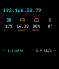

# pi-status-display

Plug-and-play USB status display for a Raspberry Pi: a Go agent on the Pi pushes system
status over USB CDC to an ESP32-S3 running an LVGL UI on a 1.69" ST7789V2 touch display.

```
Raspberry Pi  --[agent]-->  USB CDC (JSON, ~1 Hz)  -->  ESP32-S3 + ST7789V2/CST816  --[LVGL UI]
```



## Why

I run a lot of Pis and headless servers, and wanted a quick way to spot IP address and health
at a glance in the server room without SSH-ing in. UI heavily inspired by
[JetKVM](https://jetkvm.com/)'s on-device display.

## Hardware

Built around a [Waveshare ESP32-S3-Touch-LCD-1.69](https://www.waveshare.com/product/esp32-s3-touch-lcd-1.69.htm)
— I had a spare one with a dead WiFi radio, which doesn't matter here since everything comes
in over USB CDC. The cheaper RP2040 variant of the same board should work too (not tested).
Nothing stops you from wiring the bare SPI/I2C ST7789V2 + CST816 module directly to a Pi's
GPIO instead, but you'd lose the point of this project: a USB CDC device is portable across
any host, so the same display can be unplugged and moved between servers. A GPIO-wired
display is soldered to one specific Pi.

## Layout

- `schema/` — JSON Schema, source of truth for the wire protocol (`status.schema.json`, `command.schema.json`)
- `agent/` — Go daemon that collects Pi metrics and pushes them over serial/socket
- `firmware/` — PlatformIO project for the display; `esp32s3` env targets the real hardware,
  `native` env builds an SDL2 emulator for development without a board

## Protocol

Newline-delimited JSON, push-only from Pi to ESP32, additive-only schema (`v` field for
versioning; unknown keys must be ignored by consumers). Commands flow ESP32 → Pi as
fire-and-forget `{"cmd": "reboot|shutdown|refresh"}`, confirmed by long-press on the device.

## Agent

```
cd agent
go build ./cmd/pi-status-agent
```

Config lives at `/etc/pi-status/config.yaml` (see `agent/config.example.yaml`) — serial port,
socket path, poll interval, alert thresholds, and the list of systemd services to monitor.
Packaging for a `.deb` with systemd unit and udev rule (`/dev/pi-display` symlink by VID/PID)
is under `agent/packaging/`.

Run locally without hardware:

```
./pi-status-agent --local
```

### Installing on a Pi

```
agent/packaging/build-deb.sh          # -> /tmp/pi-status-agent_<version>_arm64.deb
sudo dpkg -i /tmp/pi-status-agent_*.deb   # installs binary, systemd unit, udev rule; starts the service
```

or, over SSH with key-based auth already set up:

```
agent/packaging/deploy.sh pi@your-pi.local
```

The udev rule in `agent/packaging/udev/` symlinks the ESP32-S3's USB CDC device to
`/dev/pi-display`; edit the `idVendor`/`idProduct` in it if your board reports different USB IDs.

## Firmware / emulator

Requires [PlatformIO](https://platformio.org/).

```
cd firmware
pio run -e esp32s3 -t upload   # flash real hardware
pio run -e native              # build SDL2 emulator (needs sdl2, libcjson via pkg-config)
.pio/build/native/program
```

The emulator connects to the same Unix socket the agent writes to
(`/tmp/pi-status.sock` by default), so you can develop the UI without a board attached.

See `firmware/README.md` for the icon/font regeneration scripts, and `scripts/` for
repo-wide maintenance scripts (emulator screenshots, third-party license notices).

## License

BSD 3-Clause, see [LICENSE](LICENSE). Icon assets under `firmware/src/ui/icons/` are generated
from [Lucide](https://lucide.dev) (ISC License) — see LICENSE for the attribution notice. Font
assets under `firmware/src/ui/fonts/` are generated from
[JetBrains Mono](https://github.com/JetBrains/JetBrainsMono) (SIL Open Font License 1.1) — see
LICENSE for the attribution notice.
